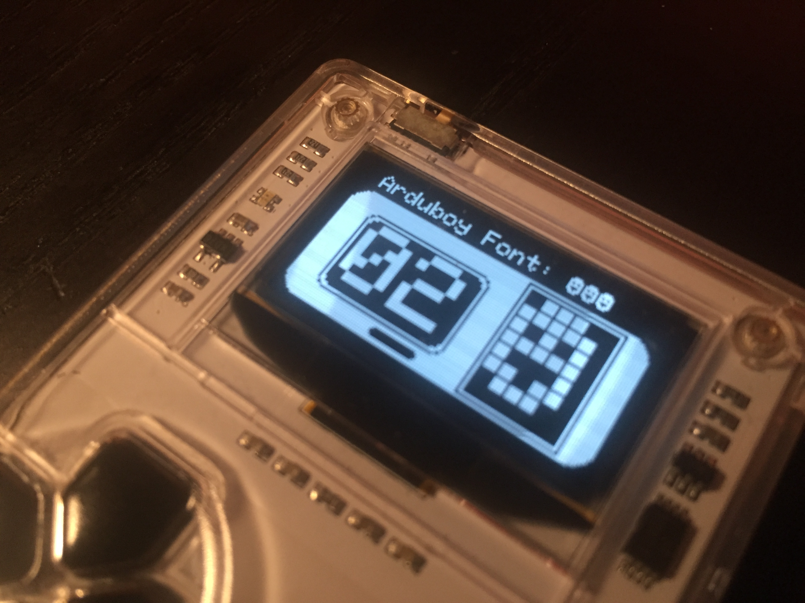

# Arduboy Font Viewer

This little program lets you go through each font in an ASCII character set and displays it in size 6, with a grid overlay.

That's it.

Seriously. There is nothing else.

## Commands

- **UP** Incriments the selected hex character
- **DOWN** Deincriments the selected hex character
- **LEFT** Selects first hex character
- **RIGHT** Selects second hex character

Hold up/down to continue changing the value.

